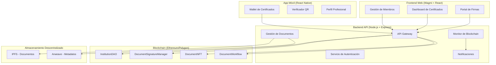
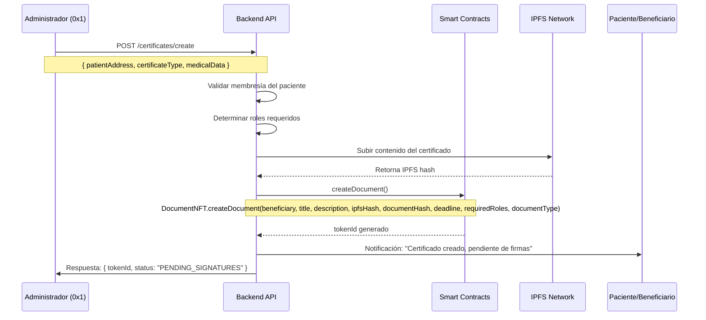
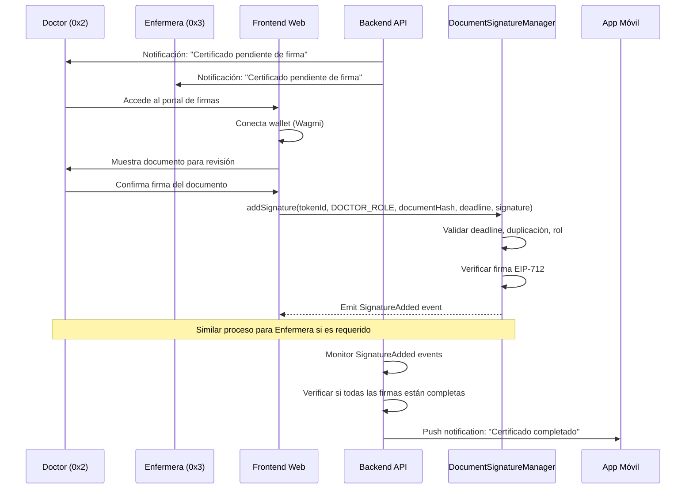
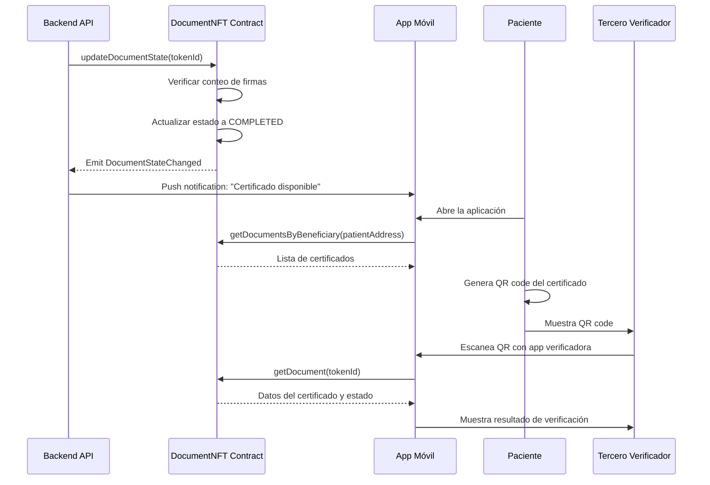

# Arquitectura del Sistema de Firmas Digitales - CNS (Colegio Nacional de Salud)

## Resumen Ejecutivo

Este documento describe la arquitectura completa para el sistema de certificación digital del Colegio Nacional de Salud (CNS), que permite la emisión, firma y gestión de certificados médicos como NFTs en blockchain. El sistema está diseñado para garantizar la autenticidad, trazabilidad y seguridad de los documentos institucionales.

## Configuración Inicial del Sistema

### Institución Configurada: CNS
- **Nombre**: Colegio Nacional de Salud
- **Contratos**: Desplegados y configurados
- **Estado**: Operativo

### Miembros Configurados

| Dirección | Rol | Departamento | Permisos |
|-----------|-----|--------------|----------|
| `0x1` | Administrador/Miembro General | Administración | Admin, Gestión General |
| `0x2` | Doctor | Medicina General | Firma de Certificados Médicos |
| `0x3` | Enfermera | Enfermería | Firma de Certificados de Procedimientos |

### Contratos Desplegados
- ✅ `InstitutionDAO`: Gestión de miembros y roles
- ✅ `DocumentSignatureManager`: Motor de firmas digitales
- ✅ `DocumentNFT`: Emisión de certificados como NFTs
- ✅ `DocumentWorkflow`: Orquestación de procesos
- ✅ `DocumentFactory`: Creación de documentos

## Arquitectura del Sistema



## Componentes de la Arquitectura

### 1. Frontend Web (Wagmi + React)

#### Propósito Principal
Portal web para la gestión y firma de documentos por parte del personal médico autorizado.

#### Tecnologías
- **React 18+**: Framework principal
- **Wagmi v2**: Integración con wallets y blockchain
- **RainbowKit**: UI de conexión de wallets
- **Tailwind CSS**: Estilos y componentes
- **React Query**: Gestión de estado servidor

#### Funcionalidades Clave
- **Portal de Firmas**: Interfaz para revisar y firmar documentos pendientes
- **Dashboard de Certificados**: Vista general de certificados emitidos y estados
- **Gestión de Miembros**: Administración de roles y permisos (solo admin)

#### Casos de Uso Específicos

**Para Doctores (0x2):**
```javascript
// Firma de certificado médico
const signMedicalCertificate = async (documentId) => {
  const { writeContract } = useWriteContract();
  
  await writeContract({
    address: SIGNATURE_MANAGER_ADDRESS,
    abi: DocumentSignatureManagerABI,
    functionName: 'addSignature',
    args: [
      documentId,
      keccak256(toBytes("DOCTOR_ROLE")),
      documentHash,
      deadline,
      signature
    ]
  });
};
```

**Para Enfermeras (0x3):**
```javascript
// Firma de certificado de procedimiento
const signProcedureCertificate = async (documentId) => {
  const { writeContract } = useWriteContract();
  
  await writeContract({
    address: SIGNATURE_MANAGER_ADDRESS,
    abi: DocumentSignatureManagerABI,
    functionName: 'addSignature',
    args: [
      documentId,
      keccak256(toBytes("NURSE_ROLE")),
      documentHash,
      deadline,
      signature
    ]
  });
};
```

### 2. Backend API (Node.js + Express)

#### Propósito Principal
Orquestación de procesos de negocio, integración con blockchain y gestión de datos off-chain.

#### Arquitectura del Backend

```javascript
// Estructura del proyecto
backend/
├── src/
│   ├── controllers/
│   │   ├── authController.js
│   │   ├── documentController.js
│   │   ├── memberController.js
│   │   └── certificateController.js
│   ├── services/
│   │   ├── blockchainService.js
│   │   ├── ipfsService.js
│   │   ├── signatureService.js
│   │   └── notificationService.js
│   ├── middleware/
│   │   ├── authentication.js
│   │   ├── authorization.js
│   │   └── validation.js
│   └── utils/
│       ├── crypto.js
│       └── blockchain.js
```

#### Servicios Críticos

**1. Blockchain Service**
```javascript
class BlockchainService {
  async createDocument(beneficiary, documentData) {
    const contract = new ethers.Contract(
      DOCUMENT_NFT_ADDRESS,
      DocumentNFTABI,
      signer
    );
    
    // Subir documento a IPFS
    const ipfsHash = await this.uploadToIPFS(documentData.content);
    const documentHash = keccak256(documentData.content);
    
    // Crear documento en blockchain
    const tx = await contract.createDocument(
      beneficiary,
      documentData.title,
      documentData.description,
      ipfsHash,
      documentHash,
      documentData.deadline,
      documentData.requiredRoles,
      documentData.documentType
    );
    
    return await tx.wait();
  }
  
  async monitorSignatures(documentId) {
    const filter = signatureManager.filters.SignatureAdded(documentId);
    
    signatureManager.on(filter, async (docId, signer, role, event) => {
      await this.updateDocumentStatus(docId);
      await this.sendNotification(docId, signer, role);
    });
  }
}
```

**2. Document Workflow Service**
```javascript
class DocumentWorkflowService {
  async initiateCertificateProcess(patientData, certificateType) {
    // 1. Validar que el paciente sea miembro
    const isMember = await this.validateMembership(patientData.address);
    if (!isMember) {
      throw new Error('Patient must be a CNS member');
    }
    
    // 2. Determinar roles requeridos según tipo de certificado
    const requiredRoles = this.getRequiredRoles(certificateType);
    
    // 3. Crear documento en blockchain
    const documentId = await this.blockchainService.createDocument(
      patientData.address,
      {
        title: `${certificateType} - ${patientData.name}`,
        description: `Certificado médico emitido por CNS`,
        content: this.generateCertificateContent(patientData, certificateType),
        deadline: Date.now() + (7 * 24 * 60 * 60 * 1000), // 7 días
        requiredRoles,
        documentType: certificateType
      }
    );
    
    // 4. Notificar a firmantes requeridos
    await this.notifyRequiredSigners(documentId, requiredRoles);
    
    return documentId;
  }
  
  getRequiredRoles(certificateType) {
    const roleMap = {
      'MEDICAL_CERTIFICATE': [keccak256(toBytes("DOCTOR_ROLE"))],
      'PROCEDURE_CERTIFICATE': [
        keccak256(toBytes("DOCTOR_ROLE")),
        keccak256(toBytes("NURSE_ROLE"))
      ],
      'DISABILITY_CERTIFICATE': [
        keccak256(toBytes("DOCTOR_ROLE")),
        keccak256(toBytes("ADMIN_ROLE"))
      ]
    };
    
    return roleMap[certificateType] || [];
  }
}
```

### 3. App Móvil (React Native)

#### Propósito Principal
Aplicación para que los beneficiarios (pacientes/miembros) puedan visualizar, gestionar y verificar sus certificados NFT.

#### Funcionalidades Principales

**1. Wallet de Certificados**
```javascript
// Componente para mostrar certificados del usuario
const CertificateWallet = ({ userAddress }) => {
  const [certificates, setCertificates] = useState([]);
  
  useEffect(() => {
    const fetchCertificates = async () => {
      const userCertificates = await contract.getDocumentsByBeneficiary(userAddress);
      setCertificates(userCertificates);
    };
    
    fetchCertificates();
  }, [userAddress]);
  
  return (
    <ScrollView>
      {certificates.map(cert => (
        <CertificateCard key={cert.tokenId} certificate={cert} />
      ))}
    </ScrollView>
  );
};
```

**2. Verificador QR**
```javascript
// Funcionalidad para verificar certificados mediante QR
const QRVerifier = () => {
  const handleQRScan = async (qrData) => {
    const { tokenId, hash } = JSON.parse(qrData);
    
    // Verificar en blockchain
    const document = await contract.getDocument(tokenId);
    const isValid = document.documentHash === hash && 
                   document.state === DocumentState.COMPLETED;
    
    setVerificationResult({ valid: isValid, document });
  };
  
  return (
    <QRCodeScanner onScan={handleQRScan} />
  );
};
```

## Workflow Detallado del Proceso de Certificación

### Fase 1: Inicialización del Certificado



### Fase 2: Proceso de Firmas



### Fase 3: Finalización y Entrega



## Casos de Uso Específicos por Rol

### Administrador (0x1)

**Responsabilidades:**
- Gestión de miembros del CNS
- Creación de nuevos tipos de certificados
- Supervisión del sistema
- Configuración de roles y permisos

**Flujo Típico:**
1. Accede al dashboard administrativo
2. Crea nuevo certificado para paciente miembro
3. Configura roles requeridos para firma
4. Monitorea progreso de firmas
5. Valida certificados completados

### Doctor (0x2)

**Responsabilidades:**
- Revisión médica de certificados
- Firma digital de documentos médicos
- Validación de información clínica

**Flujo Típico:**
1. Recibe notificación de certificado pendiente
2. Accede al portal web de firmas
3. Conecta su wallet MetaMask
4. Revisa información médica del paciente
5. Firma digitalmente el certificado
6. El sistema actualiza automáticamente el estado

### Enfermera (0x3)

**Responsabilidades:**
- Firma de certificados de procedimientos
- Validación de datos de enfermería
- Soporte en procesos administrativos

**Flujo Típico:**
1. Recibe notificación de certificado que requiere su firma
2. Accede al portal web
3. Revisa información de procedimientos realizados
4. Firma digitalmente cuando corresponde
5. Monitorea certificados en proceso

### Paciente/Beneficiario

**Responsabilidades:**
- Gestión de sus certificados NFT
- Verificación de autenticidad
- Compartir certificados con terceros

**Flujo Típico:**
1. Recibe notificación de certificado creado
2. Descarga la app móvil CNS
3. Conecta su wallet para ver certificados
4. Genera QR code para verificación
5. Comparte con empleadores/instituciones

## Consideraciones de Seguridad

### 1. Autenticación y Autorización
- **Web3 Authentication**: Firma de mensajes para verificar identidad
- **Role-Based Access Control**: Validación de roles en cada operación
- **Session Management**: Tokens JWT con expiración configurable

### 2. Seguridad en Firmas
- **EIP-712**: Firmas tipificadas para legibilidad y seguridad
- **Deadline Validation**: Expiración automática de procesos
- **Anti-Replay Protection**: Prevención de reutilización de firmas

### 3. Protección de Datos
- **Encryption at Rest**: Datos sensibles encriptados en IPFS
- **Access Logging**: Registro completo de accesos y operaciones
- **Data Minimization**: Solo datos necesarios en blockchain

## Métricas y Monitoreo

### KPIs del Sistema
- **Tiempo Promedio de Certificación**: Meta < 24 horas
- **Tasa de Éxito de Firmas**: Meta > 99%
- **Disponibilidad del Sistema**: Meta > 99.9%
- **Certificados Emitidos por Mes**: Tracking de volumen

### Alertas Automatizadas
- Certificados próximos a expirar sin firmar
- Fallos en verificación de firmas
- Intentos de acceso no autorizados
- Problemas de conectividad con blockchain

## Escalabilidad y Optimización

### Optimización de Costos de Gas
- **Batch Operations**: Agrupación de operaciones cuando sea posible
- **Layer 2 Solutions**: Consideración de Polygon para reducir costos
- **Gas Price Optimization**: Monitoreo y ajuste automático

### Escalabilidad Horizontal
- **Load Balancing**: Distribución de carga en backend
- **Database Sharding**: Partición de datos por institución
- **CDN Integration**: Distribución global de contenido

## Conclusión

Esta arquitectura proporciona una solución robusta, segura y escalable para la gestión de certificados médicos digitales del CNS. La combinación de blockchain para inmutabilidad, IPFS para almacenamiento descentralizado, y aplicaciones modernas para UX garantiza un sistema de clase mundial que cumple con los más altos estándares de seguridad y usabilidad en el sector salud.

La implementación por fases permite un despliegue gradual, validación temprana con usuarios reales, y ajustes incrementales basados en feedback operativo, asegurando el éxito del proyecto a largo plazo.
